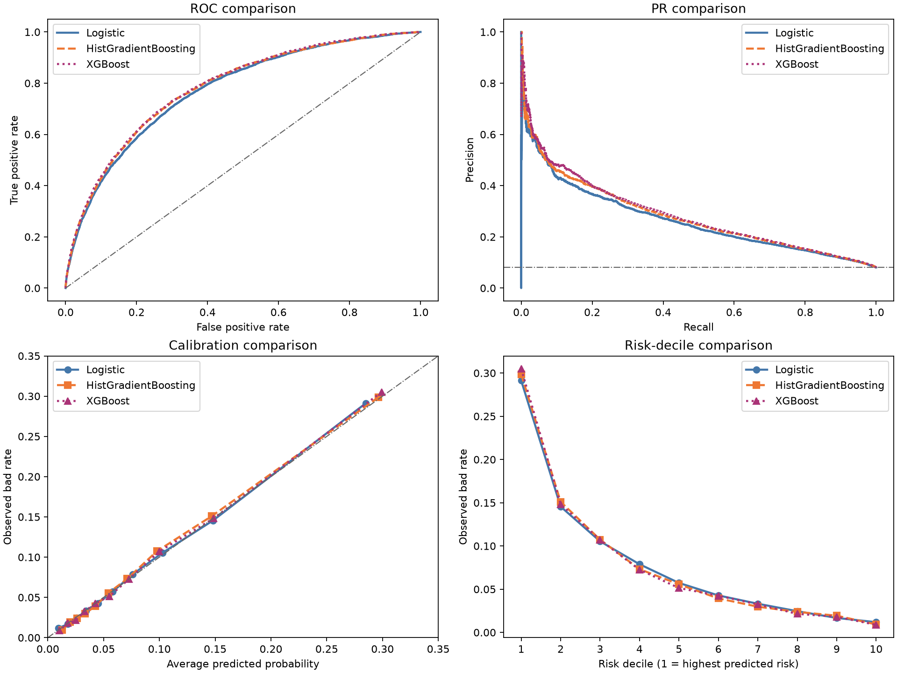
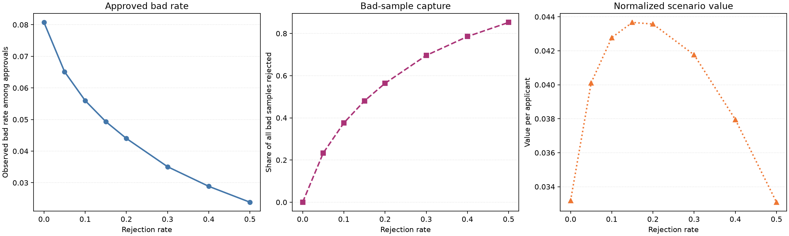

# SmartCredit

An end-to-end consumer-credit risk project built on the Kaggle Home Credit
Default Risk dataset. It covers multi-table data quality, applicant-level
feature marts, leakage-aware model validation, probability calibration,
credit-policy simulation, and an interactive Streamlit dashboard.

> **Portfolio scope:** This repository demonstrates an independently built
> analytical workflow. It does not contain the Kaggle data, and its policy
> economics are explicitly illustrative rather than a real bank's underwriting
> policy.

## Portfolio snapshot

- Processed about **2.5 GB** of application, bureau, previous-loan, POS/cash,
  credit-card, and installment data in DuckDB.
- Built `raw`, `mart`, and `meta` schemas plus an applicant-level feature matrix
  containing **356,255 rows and 198 columns**.
- Compared Logistic Regression, HistGradientBoosting, and XGBoost on the same
  61,503-applicant holdout.
- Tuned XGBoost using a fixed-budget three-fold search inside the development
  sample; the selected model achieved **0.78545 local ROC-AUC**.
- Submitted continuous risk probabilities to Kaggle after the deadline:
  **0.77905 Public / 0.77994 Private ROC-AUC**.
- Used cross-fitted out-of-fold probabilities to compare raw, Platt, and
  Isotonic calibration without fitting calibrators on the outer holdout.
- Converted probabilities into rejection-capacity and three-band policy
  scenarios, then exposed the trade-offs in Streamlit.

## Model results

| Model | ROC-AUC | PR-AUC | KS | Brier |
|---|---:|---:|---:|---:|
| Logistic Regression | 0.7727 | 0.2641 | 0.4087 | 0.0668 |
| HistGradientBoosting | 0.7818 | 0.2783 | 0.4286 | 0.0661 |
| XGBoost | 0.7844 | 0.2846 | 0.4305 | 0.0658 |
| Tuned XGBoost | **0.7855** | **0.2861** | **0.4314** | **0.0658** |



The local holdout was 0.00551 higher than the Kaggle Private score. This gap is
reported rather than hidden: random stratified validation did not fully match
the hidden test distribution. See the
[Kaggle submission report](reports/modeling/kaggle_submission_report.md).

## Credit-policy simulation

| Rejection capacity | Approval rate | Observed bad rate among approvals | Bad-sample capture |
|---:|---:|---:|---:|
| 0% | 100% | 8.07% | 0.00% |
| 10% | 90% | 5.60% | 37.58% |
| 15% | 85% | 4.94% | 48.04% |
| 20% | 80% | 4.40% | 56.37% |
| 30% | 70% | 3.51% | 69.59% |



The economic curve assumes normalized EAD of 1, an 8% performing-loan margin,
and 50% loss on a bad sample. It is a sensitivity example, not an estimated
profit curve or a recommended cutoff.

## Architecture

```text
Kaggle CSV files
    -> raw DuckDB tables
    -> account- and applicant-level mart features
    -> shared stratified holdout
    -> Logistic / HGB / XGBoost
    -> controlled XGBoost tuning
    -> OOF calibration assessment
    -> policy simulation
    -> Streamlit dashboard
```

Key implementation choices:

- Two-stage bureau aggregation prevents monthly records from multiplying
  account-level balances and credit amounts.
- All model comparisons use the same applicant IDs and labels.
- Hyperparameter search stays inside the development sample; the outer holdout
  is not used to choose parameter combinations.
- Calibration methods are selected on cross-fitted development predictions.
- Raw data, DuckDB files, predictions, and model binaries are reproducible local
  artifacts and are excluded from Git.

## Reproduce locally

1. Join the [Home Credit Default Risk competition](https://www.kaggle.com/competitions/home-credit-default-risk)
   and place its extracted files under
   `data/raw/home-credit-default-risk/`.
2. Install the environment and run the pipeline:

```bash
uv sync
uv run python scripts/audit_raw_data.py
uv run python scripts/build_duckdb.py
uv run python scripts/train_logistic_baseline.py
uv run python scripts/train_hist_gradient_boosting.py
uv run python scripts/train_xgboost.py
uv run python scripts/tune_xgboost.py
uv run python scripts/calibrate_and_simulate_policy.py
uv run streamlit run app/streamlit_app.py
```

Quality checks:

```bash
uv run ruff check .
uv run ruff format --check .
uv run pytest -q
```

## Limitations

- `TARGET` is the competition's repayment-difficulty label, not a regulatory
  default definition.
- The source data lacks an absolute application timestamp, so the current
  holdout is stratified rather than strictly out-of-time.
- The repository excludes real pricing, funding cost, EAD, LGD, recovery, and
  operating-cost data; policy values are scenario assumptions.
- The Late Submission score is not an official 2018 placement or award. A
  Private score of 0.77994 is historically comparable to roughly ranks
  3,930-3,935 among 7,180 displayed leaderboard rows, but this is not claimed as
  an official rank.

---

## 中文项目说明

基于 Home Credit 多表数据的消费信贷违约概率与授信策略项目。

## 项目目标

从贷款申请、外部征信、历史申请、信用卡余额和分期还款记录中建立可复现的数据管道，预测申请人的还款困难概率，并在明确假设下分析审批率与风险之间的权衡。

## 第一版业务问题

1. 哪些申请特征和历史信用行为与还款困难高度相关？
2. Logistic Regression 与梯度提升模型相比，区分度、校准度和稳定性如何？
3. 不同风险阈值会怎样改变模拟审批率和坏账率？
4. 如何用可解释结果生成可审计的风险分层，而不是只输出一个分类标签？

## 证据边界

- `TARGET` 表示比赛定义的还款困难标签，不等同于监管口径的违约。
- 数据不包含真实资金成本、利率收入、运营成本与回收率；收益分析只能是明确标注假设的情景模拟。
- Kaggle 测试集没有公开标签，模型选择必须依赖训练集内的独立验证，不能根据公开排行榜反复调参。
- 原始比赛数据受 Kaggle 比赛规则约束，不提交到 Git 仓库。

## 数据

原始数据位于 `data/raw/home-credit-default-risk/`，通过以下键连接：

- `SK_ID_CURR`：当前申请人/申请
- `SK_ID_BUREAU`：外部征信账户
- `SK_ID_PREV`：Home Credit 历史申请

## 本地运行

```bash
uv sync
uv run python scripts/audit_raw_data.py
uv run python scripts/build_duckdb.py
uv run python scripts/train_logistic_baseline.py
uv run python scripts/train_hist_gradient_boosting.py
uv run python scripts/train_xgboost.py
uv run python scripts/tune_xgboost.py
uv run python scripts/calibrate_and_simulate_policy.py
uv run streamlit run app/streamlit_app.py
```

## DuckDB数据库

数据库位于`data/interim/smartcredit.duckdb`：

- `raw`：与Kaggle原始CSV一一对应的原生表
- `mart`：聚合至`SK_ID_CURR`粒度的主题特征表和建模矩阵
- `meta`：表清单、字段目录和关系检查

建模入口为`mart.feature_matrix_train`，Kaggle预测入口为`mart.feature_matrix_test`。

## Logistic Regression基线

运行完成后会生成：

- `reports/modeling/logistic_baseline_report.md`：验证设计、模型指标和解释边界
- `reports/modeling/logistic_baseline_metrics.json`：机器可读的训练配置与指标
- `reports/tables/logistic_baseline/`：风险十分位和模型系数
- `reports/figures/logistic_baseline/validation_diagnostics.png`：ROC、PR、校准和风险分层图
- `data/processed/logistic_baseline/submission_logistic_baseline.csv`：Kaggle提交文件
- `models/logistic_baseline/model.joblib`：使用全部已标注数据重训的最终模型

脚本默认不覆盖已有模型；确认需要重跑时使用：

```bash
uv run python scripts/train_logistic_baseline.py --overwrite
```

## HistGradientBoosting提升模型

提升模型与Logistic使用相同的80/20分层验证样本。数值缺失由树模型原生处理，类别字段经过Ordinal Encoding后作为类别特征输入。

当前同口径结果：

| 指标 | Logistic | HistGradientBoosting | XGBoost | 调优XGBoost |
|---|---:|---:|---:|---:|
| ROC-AUC | 0.7727 | 0.7818 | 0.7844 | **0.7855** |
| PR-AUC | 0.2641 | 0.2783 | 0.2846 | **0.2861** |
| KS | 0.4087 | 0.4286 | 0.4305 | **0.4314** |
| Brier Score | 0.0668 | 0.0661 | 0.0658 | **0.0658** |

主要产物：

- `reports/modeling/hist_gradient_boosting_report.md`：提升模型设计、指标和置换重要性
- `reports/modeling/model_comparison.md`：两种模型的同口径比较
- `data/processed/hist_gradient_boosting/submission_hist_gradient_boosting.csv`：Kaggle提交文件
- `models/hist_gradient_boosting/model.joblib`：使用全部已标注数据重训的最终模型

数据没有绝对申请日期，因此当前只能完成分层随机验证，不能把结果解释成严格的时间外稳定性。

## XGBoost性能模型

XGBoost使用相同的外层验证申请人，并在开发训练集内部单独划出10%进行Early Stopping。2,000轮候选上限内最终选择1,016轮，再使用全部307,511条已标注样本重训。

主要产物：

- `reports/modeling/xgboost_report.md`：XGBoost训练、验证、风险分层和置换重要性
- `reports/modeling/model_comparison.md`：Logistic、HGB和XGBoost三模型比较
- `data/processed/xgboost/submission_xgboost.csv`：Kaggle概率提交文件
- `models/xgboost/model.joblib`：包含预处理器的本地完整管道
- `models/xgboost/model.ubj`：XGBoost原生模型文件

Apple Silicon环境通过`src/smartcredit/xgboost_runtime.py`优先加载Homebrew或Anaconda提供的`libomp.dylib`，避免全局动态库路径干扰NumPy。

## XGBoost受控调优

调优只使用80%开发集中的固定120,000人样本，通过3折StratifiedKFold比较1组原始参数和9组固定随机参数。CV选定唯一候选后，才在外层61,503人验证集评价一次。

选中参数将行采样从80%提高至90%、列采样从80%降至70%，并加强L1和L2正则化；最终Early Stopping选择1,181轮。相对原始XGBoost，外层ROC-AUC提升0.0011，属于有效但有限的增量。

主要产物：

- `reports/modeling/xgboost_tuning_report.md`：搜索预算、全部候选和外层验证结果
- `reports/modeling/xgboost_tuned_metrics.json`：调优参数和机器可读指标
- `data/processed/xgboost_tuned/submission_xgboost_tuned.csv`：调优模型Kaggle概率
- `models/xgboost_tuned/model.joblib`：调优后的完整本地管道

## 概率校准与授信策略模拟

校准器使用80%开发集的三折OOF概率拟合，并在开发集OOF概率上继续执行5折交叉校准选择。Platt和Isotonic均未同时达到“Brier至少改善0.00001且Log Loss不恶化”，因此保留原始调优XGBoost概率，不为校准而校准。

在外层验证集上按风险排序模拟固定拒绝容量：

| 拒绝率 | 审批率 | 审批客群坏样本率 | 坏样本捕获率 | 误拒正常客户 |
|---:|---:|---:|---:|---:|
| 0% | 100% | 8.07% | 0.00% | 0 |
| 10% | 90% | 5.60% | 37.58% | 4,285 |
| 15% | 85% | 4.94% | 48.04% | 6,841 |
| 20% | 80% | 4.40% | 56.37% | 9,502 |
| 30% | 70% | 3.51% | 69.59% | 14,996 |

经济性示例假设正常贷款净贡献8%、坏样本损失50%、每笔EAD归一化为1；该结果只用于敏感性展示，不代表银行真实最优策略。

主要产物：

- `reports/modeling/calibration_policy_report.md`：无泄漏校准、拒绝容量和三段式策略报告
- `reports/modeling/calibration_policy_metrics.json`：机器可读的校准指标和情景假设
- `reports/tables/calibration_policy/`：阈值、拒绝容量、风险带和OOF折结果
- `reports/figures/calibration_policy/`：校准和策略权衡图
- `models/calibration/calibrators.joblib`：Platt、Isotonic及选择结果
